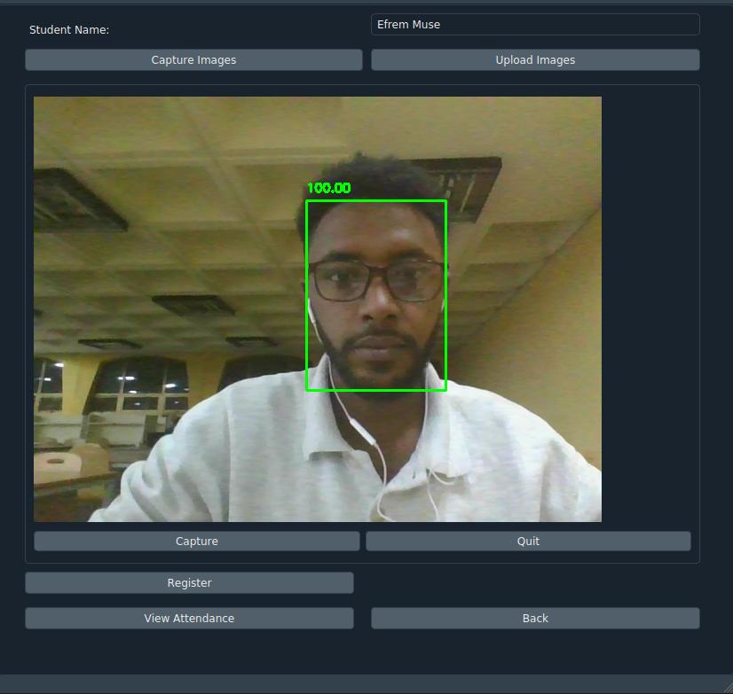
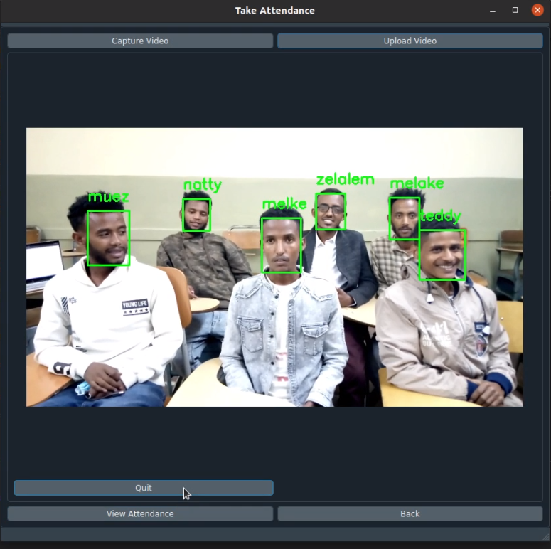
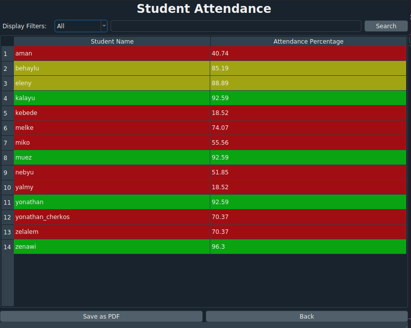

# Classroom attendance system using face-recognition

## Table of contents

- [Introduction](#introduction)
- [Technologies](#technologies)
- [Setup](#setup)
- [Demo](#demo)

## Introduction

An automatic classroom attendance system is a system that is used to automate the manual attendance marking method. The manual attendance marking method is a repetitive, time-consuming, tedious task in many schools and colleges. So by automating this traditional method, we can save more time for the actu al lecture, increase the productivity of teachers, increase students punctuality, and also generate attendance reports and its analysis result easily. An automated attendance system can be implemented using various techniques of biometrics. Face recognition is one of them which does not involve human intervention and it has been widely used in many other applications. Face recognition is a method of identifying or verifying the identity of an individual using their face. The system or desktop appI built performs nearly 100 at recognizing faces. It can successfully recognize faces at different face orientation, distance and light conditions. but It sometimes fails to recognize faces in low light conditions. in spite of that the app can work great in classrooms which have sufficient lighting conditions or day-time.

## Technologies

Project is created with:

* opencv-python: 4.5.1.48
* PyQt5: 5.15.3
* face-recognition: 1.3.0
* imutils: 0.5.4
* numpy: 1.20.1
* pandas: 1.2.2

## Setup

To run this project excute the following commands:

```
$ mkvirtualenv attendance
$ workon attendance
$ pip install requirnments.txt
$ python main.py

```

## Demo

### Register Student

A new student can be registered by entering his/her full name and capturing or uploading 10-20 face images of the student. There are two options to enter student face images. The first approach is by capturing a student’s face using a webcam. As the webcam captures a video stream and sends it to the desktop app, face detection utility widgets will detect faces and draw their bounding box with their prediction confidence in the detected face image. After that, a user can save the image which contains the face image with higher or sufficient prediction confidence.



### Take Attendance

To take student attendance we will apply face recognition using a face recognition module and face recognition widgets. The face recognition widget is connected to the take attendance page with signal and slot. So a face recognition system will be applied to each frame from the video stream or uploaded video. The webcam and face recognition system will run for about 5 minutes, and after that, it will stop recording and display the student name which is not detected in the video stream for cross-checking purposes.



### View Attendance

A teacher can also view students’ attendance results in table format. The table contains lists of the student names and corresponding student attendance percentages. The table rows are colored with different colors based on how much the student attends class. for example, if a student attends class less than 80% the row with the student’s name will be colored red(danger).


